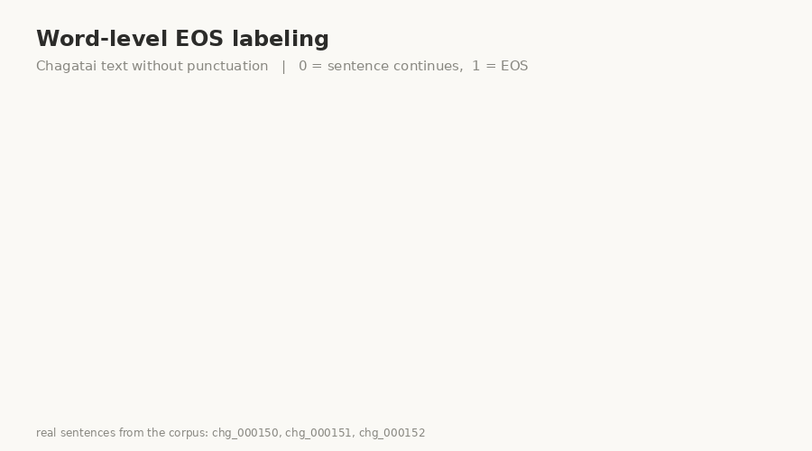
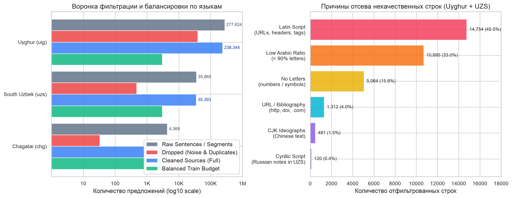
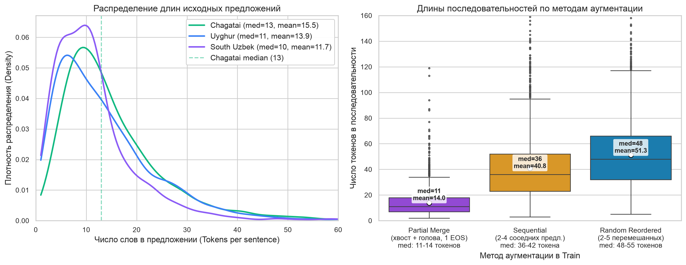

# Chagatai Sentence Segmentation

<p align="center">
  
</p>

Пайплайн готовит датасеты для определения границ предложений в чагатайском
тексте без пунктуации. Основная разметка хранится на уровне слов:

- `0`: слово не заканчивает предложение;
- `1`: последнее слово предложения (`EOS`).

Stanza-разметка `0/1/2` строится из тех же данных отдельным адаптером. Исходные
границы при этом не меняются.

## Готовые варианты

Одна команда собирает пять наборов:

| Каталог | Исходные предложения в train | Последовательности train / dev / test |
|---|---:|---:|
| `chagatai_only` | Chagatai: 3 035 | 3 045 / 145 / 295 |
| `chagatai_uyghur` | Chagatai: 3 035, Uyghur: 3 035 | 6 090 / 145 / 295 |
| `chagatai_uzs` | Chagatai: 3 035, UZS: 3 035 | 6 090 / 145 / 295 |
| `chagatai_uzs_uyghur_full` | Chagatai: 3 035, UZS: 35 393, Uyghur: 238 344 | 276 861 / 145 / 295 |
| `chagatai_uzs_uyghur_balanced` | Chagatai: 3 035, UZS: 3 035, Uyghur: 3 035 | 9 135 / 145 / 295 |

В парных наборах и в `balanced` объём каждого дополнительного языка равен
числу чагатайских train-предложений. Это баланс по исходным предложениям и
числу аугментированных последовательностей, а не по токенам. `full` оставлен
для сравнения; на диске сборка занимает около 741 МБ и сильно смещена в сторону
уйгурского корпуса.

Во всех пяти вариантах используются одни и те же Chagatai train, dev и test.
UZS и Uyghur добавляются только в train.

## Hugging Face

Датасет опубликован в Hugging Face Hub: [`chagatai-project/chagatai-sbd`](https://huggingface.co/datasets/chagatai-project/chagatai-sbd).

Доступны все пять конфигураций:

```python
from datasets import load_dataset

# 1. Загрузка сбалансированной конфигурации:
balanced = load_dataset("chagatai-project/chagatai-sbd", "chagatai_uzs_uyghur_balanced")

# Доступ к сплитам:
train = balanced["train"]            # 9 135 последовательностей (chg + uig + uzs)
validation = balanced["validation"]  # 145 последовательностей (только chg, sequential)
test = balanced["test"]              # 295 последовательностей (только chg, sequential)

# Работа с отдельной записью:
sample = train[0]
print("Текст:", sample["text"])
print("Слова (tokens):", sample["tokens"][:5])
print("Метки (labels):", sample["labels"][:5])  # 0 = внутри, 1 = граница (EOS)
print("Метод аугментации:", sample["method"])   # sequential / random / partial
assert len(sample["tokens"]) == len(sample["labels"])

# 2. Загрузка других конфигураций:
chg_only = load_dataset("chagatai-project/chagatai-sbd", "chagatai_only")  # default
chg_uig = load_dataset("chagatai-project/chagatai-sbd", "chagatai_uyghur")
chg_uzs = load_dataset("chagatai-project/chagatai-sbd", "chagatai_uzs")

# 3. Потоковая загрузка полного набора без скачивания на диск (276k строк):
full_stream = load_dataset(
    "chagatai-project/chagatai-sbd",
    "chagatai_uzs_uyghur_full",
    split="train",
    streaming=True,
)
for row in full_stream.take(3):
    print(row["sequence_id"], row["language"], len(row["tokens"]))
```

Каждая конфигурация содержит сплиты `train`, `validation` и `test`. Сплиты `validation` (145 последовательностей) и `test` (295 последовательностей) физически едины для всех пяти конфигураций: они содержат только чагатайские тексты, собранные методом `sequential`. Различается только `train`.

Поля записей:
- `tokens` (`list[str]`): список слов;
- `labels` (`list[int]`): метки границ (`0` — не граница, `1` — `EOS` в конце слова);
- `text` (`str`): очищенный текст последовательности;
- `language`, `method`, `source_sentence_ids`, `fragment_spans`, `boundary_at_end`, `num_tokens`, `num_boundaries`.

Для экспорта и выгрузки на Hub используется `scripts/prepare_hf_dataset.py`:

```bash
uv run python scripts/prepare_hf_dataset.py --upload-repo-id chagatai-project/chagatai-sbd
```

## Сборка

```bash
uv sync
uv run python scripts/build_dataset_variants.py --export-stanza
```

Результаты появятся в `data/UNIFIED/builds/`. Исходные файлы должны лежать в
`data/UNIFIED/raw/`. Оба каталога исключены из Git: датасеты собираются локально
и не попадают в историю репозитория.

Если нужен один вариант, используйте `scripts/build_unified_dataset.py`. Например:

```bash
uv run python scripts/build_unified_dataset.py --export-stanza
```

## Правила подготовки данных

Chagatai делится в исходном порядке: 70% train, 10% dev и 20% test. Разделение
выполняется до аугментации.

В train используются три способа сборки последовательностей:

- `sequential`: от 2 до 4 соседних предложений в исходном порядке;
- `random`: от 2 до 5 разных несоседних предложений с изменённым порядком;
- `partial`: конец одного предложения и начало другого. Последний токен второго
  фрагмента не получает `EOS`.

Dev и test содержат только последовательный Chagatai. Random и partial туда не
попадают.

Очистка удаляет пунктуацию, диакритику, управляющие символы и строки с остатками
латиницы, кириллицы, CJK, URL или библиографического мусора. Для каждой
последовательности сохраняются идентификаторы исходных предложений и границы
использованных фрагментов.

## Проверки

Сборка останавливается при любой из этих ошибок:

- одно исходное предложение попало в разные части Chagatai;
- вспомогательные тексты совпали с Chagatai dev или test;
- одинаковый текст появился в разных частях или повторился внутри одной части;
- токены не совпали с исходными фрагментами;
- число токенов и меток различается;
- random-группа сохранила книжный порядок или содержит соседние предложения;
- partial-пример получил ложный `EOS` в конце.

Последняя сборка всех пяти вариантов прошла эти проверки. Дополнительно
проверены 92 287 random-последовательностей: сохранённого книжного порядка и
соседних источников не осталось. Тесты проекта: `12 passed`.

Общий отчёт записывается в
`data/UNIFIED/builds/variants_manifest.json`. В каждом каталоге также лежит свой
`manifest.json` с параметрами, хэшами входных файлов и результатами валидации.

## Файлы одной сборки

- `source_sentences.csv`: очищенные предложения, split и источник;
- `train.csv`, `dev.csv`, `test.csv`: текст, токены и метки на уровне слов;
- `stats.csv`: число последовательностей, токенов и границ по языкам и методам;
- `manifest.json`: параметры и результаты проверок;
- `stanza/`: производные `.txt` и `.toklabels`, если указан `--export-stanza`.

## Код

```text
src/unified_dataset/
  cleaning.py
  sources.py
  augmentation.py
  labeling.py
  validation.py
  adapters/stanza.py
scripts/
  build_unified_dataset.py
  build_dataset_variants.py
  generate_eda_plots.py
  make_eos_demo.py
  prepare_hf_dataset.py
assets/
  eda_cleaning_noise.png
  eda_token_distributions.png
eos_demo.gif
```

Основное обучение запускается из `stanza.ipynb`. Для быстрой проверки кода:

```bash
uv run pytest -q
uv run python -m compileall -q src scripts tests
```

Результаты экспериментов записываются в `results.txt`. Для нового запуска нужно
указать использованный `manifest.json` или хэши входных файлов.

## Анализ и очистка данных (EDA)

Пайплайн решает задачу определения границ предложений на непунктуированном историческом тексте. Исходные рукописи и вспомогательные веб-корпуса содержали технический и типографический шум, который детерминированно фильтруется перед разметкой.

### 1. Фильтрация шума и воронка данных



#### Основные проблемы сырых данных и принятые решения:

1. **Сноски и примечания в скобках (`PARENTHETICAL_FOOTNOTE_RE`):**
   - *Проблема:* В рукописях встречались цифирные сноски в восточно-арабских и европейских цифрах: `(1)`, `(١)`, `[مينك]`, `{2}`, а также слова в круглых скобках: `(یوق)`.
   - *Решение:* Цифирные сноски удаляются целиком; скобки вокруг обычных слов заменяются пробелом с сохранением слова.
   - *Почему:* Без удаления сносок модель принимает цифры за часть слова или ложно связывает скобки с концом предложения.

2. **Диакритика и огласовки (Unicode категория `M`):**
   - *Проблема:* Огласовки (харакаты: танвин `ً`, шадда `ّ`, сукун, фатха) расставлены в рукописях спорадически (например, `خصوصاً` и `خصوصا`, `اوّلکی` и `اولکی`).
   - *Решение:* Все комбинируемые диакритические знаки удаляются.
   - *Почему:* Это устраняет дублирование словарных статей токенизатора и приводит орфографию к единому стандарту рукописной традиции.

3. **Кодировочные артефакты и глифы Presentation Forms:**
   - *Проблема:* В оцифровках часть слов была набрана позиционными глифами из блока *Arabic Presentation Forms* (`\uFB50`–`\uFDFF`), например слова `ﭼﻨﻜﺰ` и `ﭼﻐﺘﺎی`, а также содержала непечатные символы ZWNJ (`\u200c`), ZWJ (`\u200d`) и маркеры направления (LTR/RTL).
   - *Решение:* Применяется нормализация `NFKC`, непечатные символы категории `Cf` заменяются пробелами.
   - *Почему:* Позиционные глифы преобразуются в стандартные буквы арабского блока (`\u0620`–`\u06FF`), обеспечивая совместимость с предобученными моделями.

4. **Межъязыковой шум во вспомогательных корпусах:**
   - *Проблема:* В корпусах уйгурского языка и южноузбекского языка присутствовал веб-мусор: латиница (14 754 строки с HTML-тегами и URL), остатки ссылок/доменов (1 312 строк с `http`, `.cn`, `doi`), китайские иероглифы CJK (481 строка) и кириллические комментарии (120 строк).
   - *Решение:* Функция `source_noise_reasons()` отбрасывает строки с запрещёнными скриптами (`LATIN`, `CYRILLIC`, `CJK`), долей арабских букв ниже 90% и остатками URL (всего отсеяно 20 342 строки).
   - *Почему:* Защищает обучение от посторонних алфавитов и предотвращает деградацию представлений при мультиязычном трансфере.

5. **Дубли страниц рукописей:**
   - *Проблема:* В файле `Chagatai_35_181.xlsx` страницы 159, 161 и 176 дублировали страницы 158, 160 и 175.
   - *Решение:* Проверка хэша содержимого страниц удалила 3 дублированные страницы, а последующая дедупликация нормализованных предложений исключила ещё 32 повтора формульных выражений.
   - *Почему:* Исключает утечку данных и завышение частотности отдельных фрагментов.

---

### 2. Распределение длин токенов и аугментация



#### Длины предложений:
- **Chagatai (`chg`):** медиана 13 токенов, среднее 15.5 токенов (95% предложений ≤ 36 токенов, максимум 131).
- **Uyghur (`uig`):** медиана 11 токенов, среднее 13.9 токенов.
- **South Uzbek (`uzs`):** медиана 10 токенов, среднее 11.7 токенов.

#### Обоснование методов аугментации в train:
В обучающей выборке последовательности формируются тремя методами в равных долях (по 1 015 последовательностей каждого типа на каждый язык):

- **`sequential` (2–4 соседних предложения в исходном порядке):**
  - Медиана: 36–42 токена, среднее: 40.8–46.1 токенов.
  - *Назначение:* Обучает модель контексту естественного связанного текста рукописи.
- **`random` (2–5 разных предложений с перестановкой):**
  - Медиана: 48–55 токенов, среднее: 51.3–58.8 токенов.
  - *Назначение:* Разрушает запоминание сюжетного порядка предложений, заставляя модель опираться на синтаксические и морфологические признаки границ.
- **`partial` (конец одного предложения + начало другого):**
  - Медиана: 11–14 токенов, среднее: 14.0–15.8 токенов.
  - *Назначение:* Единственный тип примеров, где финальный токен **не является** концом предложения (`boundary_at_end = False`, метка 0). Это предотвращает дефект, при котором модель механически ставит границу в конце любого переданного блока текста.

Dev (145 примеров) и Test (295 примеров) содержат **только последовательный чагатайский текст** без искусственных перестановок и разрывов, что обеспечивает валидную оценку на естественном тексте.
